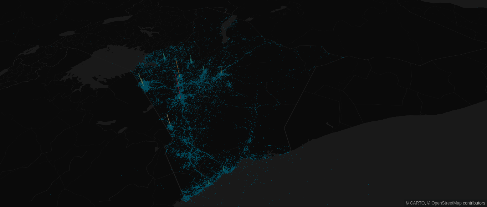

### Usage

Copy the content of this folder to your project.

        # install dependencies
        npm install
        # or
        yarn
        # bundle and serve the app with webpack
        npm start

The 1 million records visualized in the map is generated from the kenyan data.

